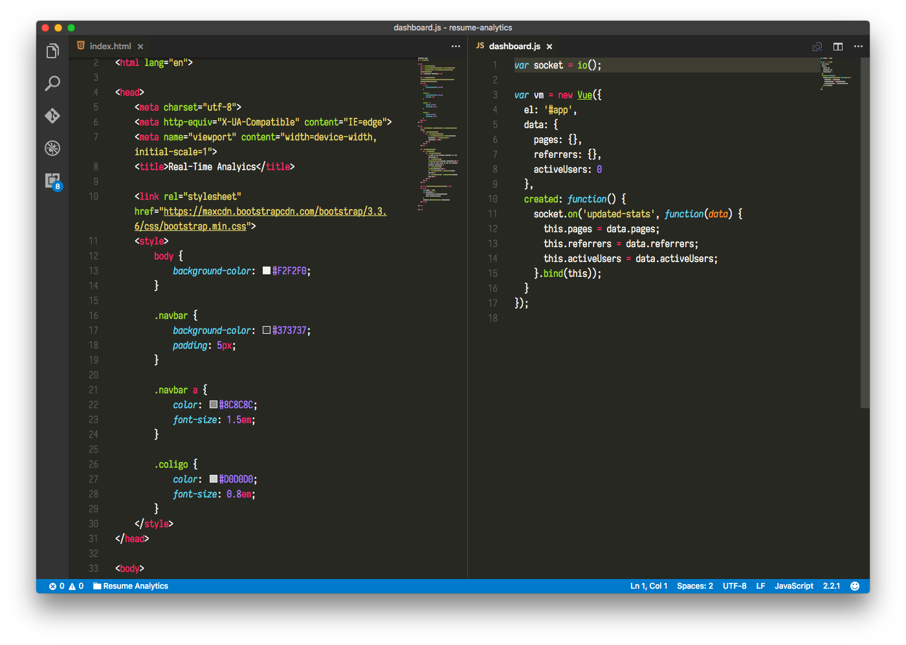

# Iosevka

Customized version of Iosevka font. Source repository: https://github.com/be5invis/Iosevka

## Build

Build from [source](https://news.ycombinator.com/item?id=14010450):

```bash
make custom-config design='v-tilde-low v-asterisk-low v-underscore-low v-at-short v-zero-dotted term' && make custom
```

    This gives me:
        - Disabled ligatures (I don't like them for my coding font)
        - Underscore below the baseline (it is called underscore, after all)
        - Tilde and asterisk centered vertically
        - Zero with dots through it

## Installation

ttf output files are in directory `dist/iosevka-custom`. On Mac, dbl-click font files to install.

## Visual Studio Code

Open `Preferences > Settings`. Relevant settings:

```json
"editor.fontFamily": "Iosevka Term",
"editor.fontSize": 15,
"editor.fontWeight": "200",
```

Lightening up the font-weight really pops the clarity on my external display.

## Screen shot

